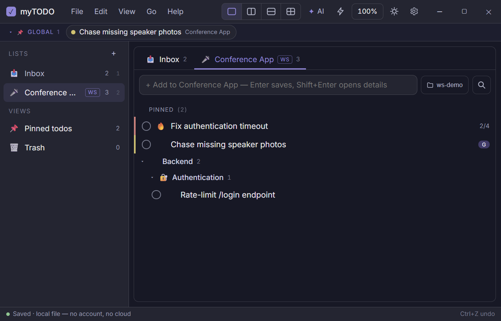
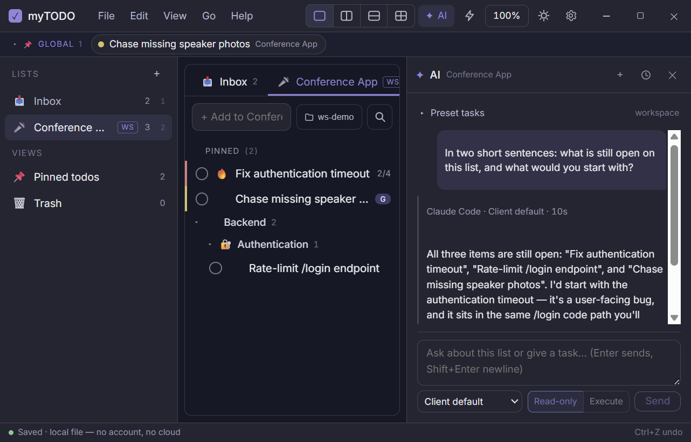

# myTODO

[](https://github.com/lexandro/mytodo/actions/workflows/ci.yml)
[](https://github.com/lexandro/mytodo/releases/latest)
[](https://github.com/lexandro/mytodo/releases)
[](https://github.com/lexandro/mytodo/releases/latest)
[](LICENSE)

A fast, keyboard-first todo workspace for Windows — for developers who want to
jot down a task in two seconds while working and get back to it. Everything is
local: no account, no cloud, no telemetry. Optionally, a todo list can be
linked to a project directory, and the AI CLI you already use (Claude Code or
Codex) can work against it — with every proposed change reviewed by you.

Native app: Tauri v2 (Rust) + Svelte 5 + SQLite, ~8 MB exe.



## Highlights

- **Tabbed workspace** — multiple lists (permanent Inbox), groups up to 3 levels
- **Split panes** — 1 / 2 / 2×2 layouts, a different list per pane
- **Zero-friction capture** — Quick Add (Enter saves) and a global Quick Add
  window that works from anywhere
- **Summon Workspace** — `Ctrl+Alt+T` brings the window to your *current*
  Windows virtual desktop instead of switching you to another one
- **Local-first, portable** — SQLite next to the exe, daily backups, JSON
  import/export
- **Live updates** — signed updates from GitHub Releases, always offered,
  never installed behind your back
- **AI Workspace Integration** — see below

## Install

From the [Releases](https://github.com/lexandro/mytodo/releases/latest) page:

- **Installer** (recommended): `myTODO_x.y.z_x64-setup.exe` (NSIS) or `.msi`.
  The installed app checks for updates every 6 hours and offers them in the
  status bar; `Help → Check for updates…` checks on demand.
- **Portable**: `myTODO-vx.y.z-portable.zip` — unzip and run, your data stays
  in the folder. It notifies about new versions but you swap the exe yourself.

`Help → What's new` lists what changed in the version you are running.

## AI Workspace Integration



> **You need an AI CLI installed on your machine.** myTODO does not talk to
> any AI service itself: it drives [Claude Code](https://claude.com/claude-code)
> and/or the [Codex CLI](https://github.com/openai/codex) that you have already
> installed and logged in to (`claude` / `codex login`). It never asks for or
> stores API keys or accounts, and without a client installed the app is a
> completely normal todo app — the AI surfaces just stay quiet.

**Setup**

1. Install and authenticate Claude Code and/or Codex in their own CLI.
2. `File → AI Clients…` → **Auto Detect** (finds them on your PATH) or
   **Browse…**; **Test** verifies the executable and, where the CLI supports
   it, that you are logged in. Optionally pick a model per client.
3. Right-click a list → **Link Workspace…** and choose the project directory
   that list is about. Linked lists show a **WS** badge.

**Using it** — `✦ AI` (or `Ctrl+Shift+A`) opens the side panel, where you
either pick a preset task or just type:

| | |
| --- | --- |
| **Preset tasks** | Investigate, Break into Subtasks, Plan Implementation, Implement, Verify (per todo) · Analyze Workspace, Suggest Todos, Reconcile, Ask Workspace (per list) |
| **Conversation** | Ask anything about the list or the workspace and keep asking — follow-ups continue the CLI's own session, so it remembers the thread |
| **Permission mode** | A conversation is **read-only** unless you switch it to Execute *before* the first turn, and stays that way; of the presets only Implement may write |
| **Proposals** | Todo changes arrive as reviewable proposals — Apply Selected is one batch that a single `Ctrl+Z` undoes. The AI never writes your data directly and never sees your database |

The run happens inside the linked directory, so your `CLAUDE.md` / `AGENTS.md`
apply as usual — myTODO neither reads nor writes them.
Details and the security model: [`doc/ARCHITECTURE.md`](doc/ARCHITECTURE.md).

## Keyboard

Full map: `F1` in the app.

| Action | Keys |
| --- | --- |
| New todo / focus quick add | `Ctrl+N` |
| New list | `Ctrl+Shift+N` |
| Switch list | `Ctrl+1…9` / `Ctrl+K` |
| Filter current list / global search | `Ctrl+F` / `Ctrl+Shift+F` |
| Toggle done ↔ open | `Ctrl+Enter` |
| Pin to list · Rename · Delete | `Ctrl+P` · `F2` · `Delete` |
| Undo | `Ctrl+Z` |
| AI panel | `Ctrl+Shift+A` |
| Todo text size | `Ctrl+mouse wheel` |

**Global shortcuts** (work while another app is focused, configurable in
`File → Settings…`): `Ctrl+Alt+T` Summon Workspace, `Ctrl+Shift+Space` Global
Quick Add. Pinned Todos and Global Search can be assigned too. Rebinding is
transactional — the old combination keeps working until the new one registers
— and a conflict with another app is reported instead of failing silently.

## Your data

Everything lives next to the executable (`File → Settings…` shows the exact
paths with an *Open folder* button):

- `data/todo.db` — SQLite, written through on every change
- `backup/todo-YYYY-MM-DD.db` — one automatic backup per day plus
  `File → Backup now`; the newest 10 are kept and
  `File → Restore backup…` swaps one back (saving the current state first)
- `File → Export JSON… / Import JSON…` — a portable, human-readable format;
  imports are validated before anything touches the database

## Development

```
bun install
bun run app           # the app in dev mode (the first launch compiles Rust)
bun run typecheck     # svelte-check — must be green before committing
bun run test          # vitest (pure core modules)
cd src-tauri && cargo test
build.bat             # local release build + portable folder in release\myTODO
```

Prerequisites: [Rust](https://rustup.rs) + VS Build Tools (C++ workload), Bun.

`bun run app` and `build.bat` produce **development builds**: they carry a DEV
icon and report their version as `1.0.1-dev`, so a local build is never
mistaken for the installed one. `Help → About myTODO` shows the version, the
git commit the binary was built from, and a copy button for bug reports.

Releases are cut by pushing a `vX.Y.Z` tag; the workflow builds and publishes
the signed installers. The full procedure is in
[`CLAUDE.md`](CLAUDE.md#releases-and-live-update).

## Documentation

- [`CHANGELOG.md`](CHANGELOG.md) — what changed, per version
- [`doc/ARCHITECTURE.md`](doc/ARCHITECTURE.md) — how it is put together
- [`doc/FUTURE.md`](doc/FUTURE.md) — deliberately deferred ideas
- [`doc/WINDOWS-TESTS.md`](doc/WINDOWS-TESTS.md),
  [`doc/AI-TESTS.md`](doc/AI-TESTS.md) — manual test checklists
- [`doc/progress.md`](doc/progress.md) — development record and the decisions
  behind the design
- `doc/daprompt.md`, `doc/shortcut.md`, `doc/aiprompt.md` — the original
  (Hungarian) specifications, kept verbatim as source material; the `§`
  references in the code and docs point at them

## License

MIT — see [LICENSE](LICENSE).
